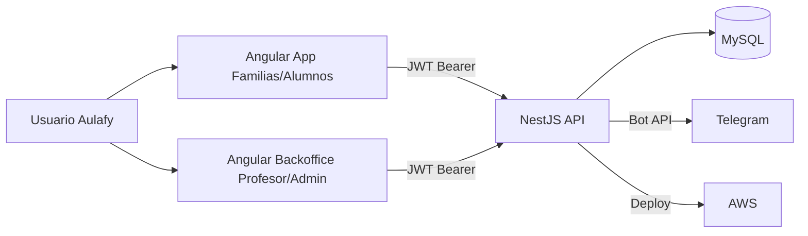

# Arquitectura de Aulafy

## Objetivo del cambio de stack

Aulafy evoluciona a un stack con:

- Frontend Angular.
- Backend NestJS (Node.js + TypeScript).
- Base de datos MySQL.
- Infraestructura en AWS con CI/CD en GitHub Actions.

El objetivo principal es alinear el desarrollo con una arquitectura moderna de JavaScript/TypeScript de extremo a extremo, manteniendo el enfoque de monolito modular y preservando reglas de negocio ya definidas (roles, seguridad y pertenencia academica).

## Estado de arquitectura (migracion)

La migracion se ejecuta de forma incremental:

- `backend/aulafy-api` (Spring Boot) se mantiene temporalmente como referencia funcional.
- `backend/aulafy-api-nest` es la nueva base activa para el backend objetivo.
- El frontend Angular se mantiene y se adapta progresivamente a los nuevos contratos del backend NestJS.
- El modelo de datos se migra de PostgreSQL a MySQL con scripts dedicados.

## Enfoque arquitectonico

Se conserva un monolito modular con separacion por dominio. Cada modulo define controladores, servicios, DTOs y entidades propias para reducir acoplamiento y facilitar pruebas.

Adicionalmente, se separa la experiencia de usuario en dos contextos de frontend:

- **App Familias/Alumnos:** interfaz tipo red social, enfoque mobile-first.
- **Backoffice Profesor/Administracion:** interfaz de productividad para escritorio.

Ambas experiencias consumen la misma API NestJS y comparten autenticacion JWT, reglas de acceso y trazabilidad.

## Arquitectura frontend (Angular + Stitch)

La implementacion de vistas se basa en el paquete UX/UI de Stitch y se estructuro con componentizacion atomica para facilitar reutilizacion:

- **Atomos (`shared/ui/atoms`)**: badges y elementos de estado.
- **Moleculas (`shared/ui/molecules`)**: encabezados de pagina y tarjetas de metricas.
- **Features (`features/*`)**: pantallas por dominio (dashboard, muro, calendario, notas, asistencia, mensajes, perfil, anotaciones, riesgo).
- **Layout (`layout/main-layout`)**: navegacion adaptativa por rol, separando experiencia de backoffice y app familias.

Esta estructura permite mantener consistencia visual entre las vistas de Stitch y el codigo Angular, reduciendo duplicacion de estilos y facilitando evolucion incremental por modulo.

## Diagrama objetivo

## Flujo principal (objetivo)

1. El usuario inicia sesion desde Angular.
2. Angular llama a `/api/auth/login` en NestJS.
3. La API valida credenciales, emite JWT y retorna perfil/roles.
4. El frontend consume modulos segun perfil (`APODERADO`, `ESTUDIANTE`, `PROFESOR`, `ADMIN`, `COLEGIO`).
5. NestJS valida autorizacion por rol y por pertenencia academica en cada caso de uso.
6. Los datos persisten en MySQL mediante TypeORM.
7. Para mensajeria y notificaciones, NestJS utiliza Telegram como canal de integracion.

## Modulos backend objetivo

- `auth`: login, JWT, guardias y estrategias.
- `users`: usuarios, roles, estado y perfil base.
- `academic-structure`: base academica institucional (niveles, ciclos, relacion ciclo-nivel y alumnos con seccion).
- `courses`: cursos, asignaturas, asignaciones y vinculos academicos.
- `feed`: publicaciones y comentarios en muro.
- `chat`: chat interno con integracion Telegram (sin enlace manual de cuenta para usuarios finales).
- `calendar`: calendario academico por curso.
- `annotations`: anotaciones/comunicaciones personales por estudiante.
- `academic`: evaluaciones, notas y resumen academico.
- `attendance`: asistencia y resumen porcentual.
- `notifications`: canal Telegram y bitacora de envios.
- `common`: errores globales, filtros, utilidades y convenciones transversales.

## Decisiones tecnicas vigentes

- JWT stateless para autenticacion entre Angular y NestJS.
- Validaciones declarativas con `class-validator` y `ValidationPipe`.
- Configuracion por variables de entorno y validacion al iniciar.
- Monolito modular para reducir complejidad operativa en etapa MVP.
- MySQL como base transaccional principal.
- Integracion Telegram encapsulada en adaptadores de infraestructura.
- Modelo academico inicial copiado y adaptado desde `childsafe`: `levels`, `cycles`, `cycle_levels` y `students` con `section` como dato libre controlado.

## Modelo academico inicial (copiado desde childsafe)

Se adopta la misma base conceptual del proyecto `childsafe` para iniciar la capa funcional academica en Aulafy:

- **Nivel (`levels`)**: catalogo institucional ordenado curricularmente (`sort_order`).
- **Ciclo (`cycles`)**: agrupador pedagogico (ej. primer ciclo basico, ensenanza media).
- **Relacion ciclo-nivel (`cycle_levels`)**: permite asignacion N:M administrable.
- **Alumno (`students`)**: ficha academica con nombre, nivel y seccion; opcionalmente vinculada a usuario estudiante/apoderado de `users`.

Esta base permite implementar reglas de pertenencia academica y luego conectar modulos de cursos, asistencia, calendario y anotaciones sobre datos consistentes.

## Criterios de migracion por fases

1. **Fase Base:** estructura NestJS, configuracion de entorno y health endpoint.
2. **Fase Seguridad y Usuarios:** auth, usuarios y permisos equivalentes al backend previo.
3. **Fase Academica:** cursos, calendario, anotaciones, notas y asistencia.
4. **Fase Comunicaciones:** feed y chat interno con Telegram.
5. **Fase Infra AWS:** pipelines, despliegue, observabilidad y endurecimiento.

Ninguna fase avanza a la siguiente sin validacion funcional y documental.

## Estado actual implementado (fase academica + comunicaciones)

En `backend/aulafy-api-nest` quedaron operativos los siguientes contratos sobre el modelo academico inicial:

- `GET /api/courses`
- `GET /api/courses/:id`
- `POST /api/courses`
- `POST /api/courses/:id/students/:studentId`
- `POST /api/courses/:id/teachers/:teacherId`
- `GET /api/courses/:courseId/subjects`
- `GET /api/courses/:courseId/students`
- `POST /api/subjects`
- `GET /api/courses/:courseId/evaluations`
- `POST /api/evaluations`
- `GET /api/students/:studentId/grades`
- `POST /api/grades`
- `GET /api/students/:studentId/academic-summary`
- `GET /api/students/:studentId/attendance`
- `POST /api/attendance`
- `GET /api/students/:studentId/attendance-summary`
- `GET /api/courses/:courseId/events`
- `POST /api/courses/:courseId/events`
- `GET /api/annotations`
- `GET /api/annotations/students/:studentId`
- `POST /api/annotations`
- `GET /api/courses/:courseId/posts`
- `POST /api/courses/:courseId/posts`
- `GET /api/posts/:postId/comments`
- `POST /api/posts/:postId/comments`
- `GET /api/notifications/logs`
- `POST /api/notifications/telegram/test`
- `POST /api/notifications/telegram/send`
- `GET /api/chat/rooms`
- `POST /api/chat/rooms`
- `GET /api/chat/rooms/:roomId/messages`
- `POST /api/chat/rooms/:roomId/messages`

Las reglas de acceso se aplican por rol y pertenencia academica (curso/alumno) para `ADMIN`, `COLEGIO`, `PROFESOR`, `APODERADO` y `ESTUDIANTE`, manteniendo coherencia con el enfoque del backend legacy.

Para bases antiguas (previas al modelo `students`), se incorpora un puente de migracion no destructivo:

- `database/mysql/migrations/20260530_academic_structure_bridge.sql`

## Integracion frontend actual (courses/academic/attendance/calendar/annotations/feed)

Las vistas Stitch de `courses`, `academic` y `attendance` en Angular ya consumen datos reales de NestJS:

- `features/courses` usa `GET /api/courses` y renderiza carga/error/empty.
- `features/academic` usa:
  - `GET /api/academic-structure/students`
  - `GET /api/students/:studentId/academic-summary`
  - `GET /api/students/:studentId/grades`
  - `GET /api/courses/:courseId/subjects`
  - `GET /api/courses/:courseId/evaluations`
- `features/attendance` usa:
  - `GET /api/academic-structure/students`
  - `GET /api/students/:studentId/attendance`
  - `GET /api/students/:studentId/attendance-summary`
- `features/calendar` usa:
  - `GET /api/courses`
  - `GET /api/courses/:courseId/events`
  - `POST /api/courses/:courseId/events`
- `features/annotations` usa:
  - `GET /api/courses`
  - `GET /api/courses/:courseId/students`
  - `GET /api/annotations`
  - `POST /api/annotations`
- `features/feed` usa:
  - `GET /api/courses`
  - `GET /api/courses/:courseId/posts`
  - `POST /api/courses/:courseId/posts`
  - `GET /api/posts/:postId/comments`
  - `POST /api/posts/:postId/comments`
- `features/notifications` usa:
  - `GET /api/notifications/logs`
  - `POST /api/notifications/telegram/test`
  - `POST /api/notifications/telegram/send`
- `features/messages` y `features/chat` usan:
  - `GET /api/chat/rooms`
  - `GET /api/chat/rooms/:roomId/messages`
  - `POST /api/chat/rooms/:roomId/messages`

Con esto, la experiencia mobile (apoderado/estudiante) y backoffice (profesor/admin) deja de depender de mock para los modulos academicos base.

Adicionalmente, backoffice permite operaciones de escritura desde UI en los modulos integrados:

- Crear evaluaciones (`POST /api/evaluations`).
- Registrar notas (`POST /api/grades`).
- Registrar asistencia (`POST /api/attendance`).
- Crear eventos de calendario (`POST /api/courses/:courseId/events`).
- Registrar anotaciones (`POST /api/annotations`).
- Crear publicaciones del muro (`POST /api/courses/:courseId/posts`).
- Registrar comentarios en publicaciones (`POST /api/posts/:postId/comments`).
- Ejecutar test Telegram y envios manuales con bitacora (`/api/notifications/*`).

Para bases existentes previas a calendario/anotaciones funcionales se agrega:

- `database/mysql/migrations/20260530_calendar_annotations_bridge.sql`
- `database/mysql/migrations/20260531_notifications_bridge.sql`
- `database/mysql/migrations/20260531_chat_bridge.sql`

En notificaciones se soporta modo degradado: si `TELEGRAM_BOT_TOKEN` no esta configurado, la API registra el intento en `notification_logs` con estado `NOT_CONFIGURED` para no bloquear la operacion del backoffice.

Adicionalmente, en calendario se habilito despacho automatico: al crear un evento con `notifyTelegram=true`, el backend resuelve participantes del curso (profesores, estudiantes y apoderados con `telegram_chat_id`) y registra un envio por destinatario en la bitacora.

En anotaciones tambien se habilito despacho automatico: al crear una anotacion, se notifica por Telegram al estudiante/apoderado vinculados que tengan `telegram_chat_id`, con trazabilidad por destinatario en `notification_logs`.

En chat interno se habilito flujo end-to-end por sala de curso: listado de salas visibles por rol/pertenencia, lectura de mensajes, envio de mensajes y notificacion Telegram automatica a participantes del curso (excepto autor) con trazabilidad por destinatario.

## Estado de infraestructura (Fase AWS)

- CI backend: `.github/workflows/backend-nest-ci.yml`
- CI frontend: `.github/workflows/frontend-angular-ci.yml`
- Deploy backend AWS ECS: `.github/workflows/backend-aws-ecs-deploy.yml`
- Deploy frontend AWS S3/CloudFront: `.github/workflows/frontend-aws-s3-deploy.yml`

Con esto la base de CI/CD queda alineada al objetivo AWS. La ejecucion final depende de configurar variables/repositorios/servicios en la cuenta AWS del proyecto.
