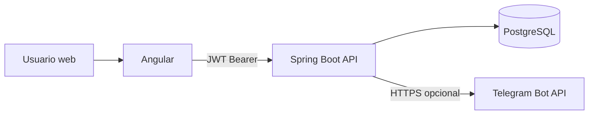

# Arquitectura de Aulafy

## Enfoque

Aulafy usa una arquitectura cliente-servidor con frontend Angular, backend Spring Boot y PostgreSQL. El backend es un monolito modular: cada dominio tiene controladores, DTOs, servicios, entidades y repositorios propios.

Esta decision evita la complejidad de microservicios en un MVP academico. El equipo puede demostrar autenticacion, roles, persistencia, API REST y pantallas funcionales sin agregar infraestructura distribuida innecesaria.

## Diagrama

## Flujo principal

1. El usuario inicia sesion desde Angular.
2. Angular envia credenciales a `/api/auth/login`.
3. Spring Security valida usuario y genera JWT.
4. Angular guarda el token y lo envia en `Authorization: Bearer`.
5. La API aplica permisos por rol, curso, estudiante y vinculo apoderado-estudiante.
6. Los repositorios JPA persisten en PostgreSQL.
7. El modulo Telegram envia mensajes si existen `TELEGRAM_BOT_TOKEN` y `TELEGRAM_CHAT_ID`.

## Modulos backend

- `auth`: login, JWT, filtros y configuracion de seguridad.
- `users`: usuarios, rol principal y estado activo.
- `courses`: cursos, estudiantes, profesores, asignaturas y vinculos academicos.
- `posts`: publicaciones institucionales o de curso.
- `comments`: comentarios simples asociados a publicaciones.
- `calendar`: eventos academicos.
- `academic`: evaluaciones, notas y resumen.
- `attendance`: asistencia y porcentaje.
- `notifications`: logs y envio por Telegram.
- `common`: errores globales, respuestas comunes y reglas transversales de acceso.

## Decisiones tecnicas

- JWT stateless para simplificar escalabilidad y consumo desde Angular.
- BCrypt para guardar contrasenas.
- DTOs para separar API publica de entidades JPA.
- Servicios para reglas de negocio y controladores delgados.
- Variables de entorno para datos sensibles.
- `ddl-auto=update` en desarrollo para facilitar la demostracion.
- Staging en Azure queda preparado, pero los recursos pagados se crean solo con autorizacion.
