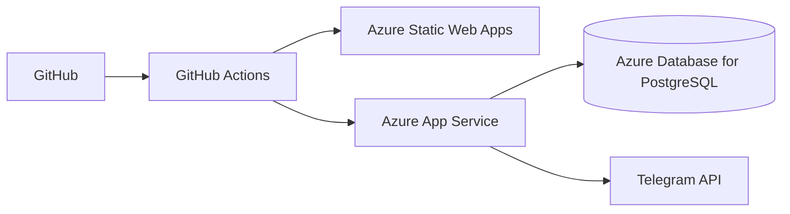

# Despliegue de Aulafy en Azure - Ambiente Staging

## A. Objetivo del despliegue

Publicar Aulafy en un ambiente cloud/staging para validar el MVP en un contexto academico. El despliegue busca demostrar frontend, backend, base de datos, autenticacion, roles y modulos principales funcionando fuera del equipo local.

## B. Arquitectura de despliegue



Servicios:

- Frontend Angular: Azure Static Web Apps.
- Backend Spring Boot: Azure App Service.
- Base de datos: Azure Database for PostgreSQL Flexible Server.
- Automatizacion: GitHub Actions.
- Secretos: GitHub Secrets y App Settings de Azure.

## Estado actual sin costos

- Resource Group creado: `rg-aulafy-staging`.
- Region usada: `brazilsouth`.
- No se crearon PostgreSQL Flexible Server, App Service Plan ni App Service en esta iteracion.
- Los scripts seguros quedaron preparados en `infra/azure`.
- La creacion de recursos pagados queda pendiente de autorizacion manual y revision de costo.

## C. Recursos Azure a crear desde el portal

Nombres sugeridos:

- Resource Group: `rg-aulafy-staging`
- App Service Plan: `asp-aulafy-staging`
- Web App backend: `aulafy-api-staging`
- Static Web App frontend: `aulafy-web-staging`
- PostgreSQL Flexible Server: `psql-aulafy-staging`
- Database: `aulafy_db`

Usar nombres equivalentes si Azure indica que algun nombre global ya esta ocupado.

## D. Region recomendada

Elegir una region cercana o de bajo costo disponible para la suscripcion educativa. Opciones razonables:

- Brazil South
- East US
- Region disponible con menor costo en la cuenta

La decision final debe considerar disponibilidad, latencia y costo estimado antes de crear recursos.

## E. Creacion del Resource Group

1. Entrar al Azure Portal.
2. Buscar `Resource groups`.
3. Seleccionar `Create`.
4. Elegir la suscripcion disponible.
5. Nombre: `rg-aulafy-staging`.
6. Region: seleccionar la region definida para staging.
7. Revisar con `Review + Create`.
8. Crear el recurso.

## F. Creacion de PostgreSQL Flexible Server

1. Buscar `Azure Database for PostgreSQL flexible servers`.
2. Seleccionar `Create`.
3. Elegir la suscripcion disponible.
4. Resource Group: `rg-aulafy-staging`.
5. Server name: `psql-aulafy-staging`.
6. Version recomendada: PostgreSQL 16 o la version estable disponible.
7. Workload type: `Development`, si aparece disponible.
8. SKU: elegir el mas economico posible, idealmente Burstable o plan student-friendly.
9. Crear usuario administrador con nombre generico y seguro.
10. Crear password segura. No guardarla en el repositorio.
11. Networking:
    - Permitir acceso desde servicios Azure si la opcion esta disponible.
    - Permitir IP actual solo para pruebas locales.
    - Evitar abrir acceso publico amplio si no es necesario.
12. Crear el servidor.
13. Crear base de datos `aulafy_db` desde el portal o herramienta SQL.
14. Cadena JDBC sugerida, sin password:

```text
jdbc:postgresql://psql-aulafy-staging.postgres.database.azure.com:5432/aulafy_db?sslmode=require
```

## G. Creacion de Azure App Service para backend

1. Buscar `App Services`.
2. Seleccionar `Create Web App`.
3. Resource Group: `rg-aulafy-staging`.
4. Name: `aulafy-api-staging`.
5. Publish: `Code`.
6. Runtime stack: Java 17.
7. Java web server stack: Java SE, si esta disponible.
8. Operating System: Linux.
9. App Service Plan: `asp-aulafy-staging`.
10. Pricing plan: usar plan gratuito, basico o el mas economico disponible para staging.
11. Crear el recurso.
12. Ir a `Settings > Environment variables` o `Configuration`.
13. Agregar App Settings:

```text
SPRING_PROFILES_ACTIVE=staging
DATABASE_URL=jdbc:postgresql://psql-aulafy-staging.postgres.database.azure.com:5432/aulafy_db?sslmode=require
DATABASE_USERNAME=<usuario-postgresql>
DATABASE_PASSWORD=<password-postgresql>
JWT_SECRET=<clave-larga-segura>
TELEGRAM_BOT_TOKEN=
TELEGRAM_CHAT_ID=
FRONTEND_URL=https://<url-static-web-app>
PORT=8080
```

14. Guardar cambios.
15. Reiniciar App Service.
16. Descargar Publish Profile solo para cargarlo como secreto de GitHub. No subirlo al repositorio.
17. Validar:

```text
https://aulafy-api-staging.azurewebsites.net/api/health
```

Respuesta esperada:

```json
{
  "status": "UP",
  "app": "Aulafy API",
  "environment": "staging"
}
```

## H. Creacion de Azure Static Web Apps para frontend

1. Buscar `Static Web Apps`.
2. Seleccionar `Create`.
3. Nombre: `aulafy-web-staging`.
4. Resource Group: `rg-aulafy-staging`.
5. Plan: gratuito si esta disponible.
6. Region: elegir la misma region o una compatible disponible.
7. Deployment source: GitHub.
8. Seleccionar repositorio `Kath-Valenzula/Aulafy`.
9. Rama: `develop`.
10. App location: `frontend/aulafy-web`.
11. Output location: `dist/aulafy-web/browser`.
12. Build command: `npm run build:staging`, si el portal permite indicarlo.
13. Crear el recurso.
14. Copiar la URL generada por Azure Static Web Apps.
15. Actualizar `FRONTEND_URL` en App Service con esa URL.
16. Si cambia la URL real del backend, actualizar `frontend/aulafy-web/src/environments/environment.staging.ts` y reconstruir.

## I. GitHub Secrets necesarios

Ir a GitHub:

`Settings > Secrets and variables > Actions`

Agregar:

- `AZURE_WEBAPP_NAME`
- `AZURE_WEBAPP_PUBLISH_PROFILE`
- `AZURE_STATIC_WEB_APPS_API_TOKEN`
- `STAGING_API_URL`, si se decide usar para reemplazos dinamicos.
- `DATABASE_URL`, si se usa dentro de workflows.
- `DATABASE_USERNAME`
- `DATABASE_PASSWORD`
- `JWT_SECRET`
- `TELEGRAM_BOT_TOKEN`
- `TELEGRAM_CHAT_ID`

El publish profile debe copiarse completo desde Azure App Service y guardarse solo como secreto.

## J. Comandos locales de validacion antes de desplegar

```bash
docker compose up -d
```

```bash
cd backend/aulafy-api
mvn clean test
mvn clean package
java -jar target/*.jar
```

```bash
cd frontend/aulafy-web
npm install
npm run build
npm run build:staging
```

## K. Pruebas posteriores al despliegue

- Abrir URL frontend.
- Probar login admin.
- Probar login profesor.
- Probar login estudiante.
- Probar login apoderado.
- Ver dashboard.
- Ver publicaciones.
- Crear publicacion como profesor/admin.
- Ver calendario.
- Ver notas y asistencia.
- Probar `https://aulafy-api-staging.azurewebsites.net/api/health`.
- Probar notificacion Telegram si esta configurada.
- Revisar logs en App Service.

## L. Evidencias para el profesor

Capturas sugeridas:

- Resource Group creado.
- App Service creado.
- Static Web App creada.
- PostgreSQL creado.
- GitHub Actions ejecutado.
- Frontend publico funcionando.
- Backend `/api/health` funcionando.
- Login funcionando.
- Dashboard funcionando.
- Modulos principales funcionando.

## M. Control de costos

- Usar planes gratuitos o basicos si estan disponibles.
- Revisar costos antes de crear PostgreSQL Flexible Server.
- Evitar recursos premium, alta disponibilidad y escalamiento automatico para staging academico.
- Revisar `Cost Management`.
- Apagar o eliminar recursos que no se usaran.
- Para cerrar la demo, eliminar el Resource Group completo si no se necesita mantener el ambiente.

## N. Troubleshooting

Error CORS:

- Revisar `FRONTEND_URL` en App Service.
- Confirmar que la URL no tenga slash final si genera diferencias.
- Reiniciar App Service despues de cambiar variables.

Error conexion PostgreSQL:

- Validar `DATABASE_URL`.
- Confirmar usuario y password.
- Revisar firewall del servidor PostgreSQL.
- Confirmar `sslmode=require`.

Error variable `DATABASE_URL`:

- Revisar nombre exacto en App Settings.
- Confirmar que `SPRING_PROFILES_ACTIVE=staging`.
- Reiniciar App Service.

Error build Angular:

- Ejecutar `npm ci` y `npm run build:staging` localmente.
- Revisar version Node del workflow.
- Confirmar `output_location` como `dist/aulafy-web/browser`.

Error 404 backend:

- Probar `/api/health`.
- Revisar logs de App Service.
- Confirmar que el JAR desplegado sea `app.jar`.

Error 401 por JWT:

- Confirmar login exitoso.
- Revisar que el frontend envie `Authorization: Bearer`.
- Verificar `JWT_SECRET` estable entre reinicios.

Telegram no configurado:

- Es valido en staging temprano.
- La API debe registrar `NO_CONFIGURADO` y seguir funcionando.
- Para probar envio real, configurar `TELEGRAM_BOT_TOKEN` y `TELEGRAM_CHAT_ID`.

App Service no toma variables:

- Guardar cambios.
- Reiniciar App Service.
- Revisar `Log stream`.

## Referencias oficiales

- Azure App Service Java y empaquetado: https://learn.microsoft.com/en-us/azure/app-service/quickstart-java
- App Settings de Azure App Service: https://learn.microsoft.com/en-us/azure/app-service/reference-app-settings
- PostgreSQL Flexible Server: https://learn.microsoft.com/en-us/azure/postgresql/flexible-server/quickstart-create-server-portal
- Static Web Apps build configuration: https://learn.microsoft.com/en-us/azure/static-web-apps/build-configuration
- Azure Static Web Apps Deploy Action: https://github.com/marketplace/actions/azure-static-web-apps-deploy
- Azure Web Apps Deploy Action: https://github.com/Azure/webapps-deploy
